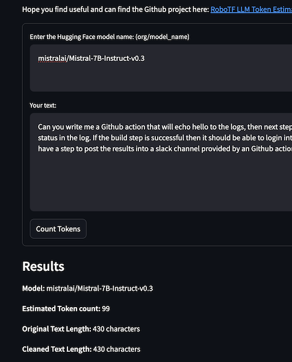

<!-- markdownlint-disable-file MD013-->
# RoboTF LLM Token Estimator 🪙


Interact with a hosted version of this app live at [<https://robotf.ai/LLM_Token_Estimator>](https://robotf.ai/LLM_Token_Estimator)

## Table of Contents

- [Description](#description)
- [About the Project](#about-the-project)
- [Features](#features)
- [Getting Started](#getting-started-🧹)
  - [Docker Compose](#option-1-docker-compose)
  - [Docker from DockerHub](#option-2-docker-hub-container)
  - [Direct Python Development](#option-3-local-development)
- [Development Setup](#development-setup)
- [Contact](#contact)
- [Contributing](#contributing-👥)
- [License](#license-📜)
- [Acknowledgements](#acknowledgments-🏆)

## Description

Welcome to the RoboTF LLM Token Estimator, a Streamlit web application that allows you to estimate the number of tokens for a given text input using a specified Hugging Face model's tokenizer. This tool is particularly useful for understanding how different models tokenize text.

This wraps up the [autotiktokenizer](https://github.com/bhavnicksm/autotiktokenizer) project into a Streamlit app. Go check it out!

## About the Project

Ever wonder how many tokens your favorite AI model needs to understand your text? With the RoboTF LLM Token Estimator, you can unlock the mystery of tokenization! Just enter your text and choose a model, and watch as we break down your input into tokens. It's like diving into the mind of an AI—but without all the heavy lifting. Whether you're a seasoned data scientist or just curious about how NLP works, this app is your key to understanding tokenization in a fun and interactive way!

## Features

- **User-Friendly Interface**: Easily enter the model name and text input.
- **Token Estimation**: Displays the estimated token count, original text length, and cleaned text length.
- **Wide Model Support**: Supports any model with a `tokenizer.json` in the Hugging Face repository.
- **Examples and Documentation**: Provides example model names and a link to browse models on the Hugging Face Hub.
- **Instructions**: Detailed instructions on how the token estimation works.
- **Efficient Caching**: Caches the tokenizer for efficiency using Streamlit's `st.cache_resource`.



## Getting Started 🧹

Choose your path with one of these three options:

### Option 1: Docker Compose

Docker Compose:

Clone the Repo:

```bash
git clone https://github.com/kkacsh321/robotf-llm-token-estimator.git

cd robotf-llm-token-estimator
```

Set Up Docker Compose: Ensure you have Docker and Docker Compose installed, then run:

```bash
docker-compose up -d --build
```

Run the App:

After Docker Compose has successfully built and started the containers, navigate to <http://localhost:8505> in your web browser.


### Option 2: Docker Hub Container

For those who wish to pull the pre-built container from Docker Hub:

Pull the Docker Image using latest tag (example v0.0.5):

```bash
docker pull robotf/robotf-llm-token-estimator:latest
```

Run the Container:

```bash
docker run -d -p 8505:8505 robotf/robotf-llm-token-estimator
```

Open your web browser to <http://localhost:8505> and let the horror unfold.


### Option 3: Local Development

For those who wish to tinker with the source code:

Clone the Repo:

```bash
git clone <git clone https://github.com/kkacsh321/robotf-llm-token-estimator.git>

cd robotf-llm-token-estimator

# Install Dependencies:

pip install -r requirements.txt
```

Run the App:

```bash
streamlit run RoboTF_LLM_Token_Estimator.py
```

or using gotask

```bash
task run
```

Follow the Streamlit link to your web browser, or navigate to the provided local URL <http://localhost:8505>

## Development Setup

This repo uses things such as precommit, task, and brew (for Mac)

Mac:
Run the setup script (if on mac with brew already installed):

```sh
./scripts/setup.sh
```

Otherwise install the required Python packages:

```sh
pip install -r requirements.txt
```

This command installs all the necessary packages, including Streamlit, langchain components, etc.

Running the App
To run the app, navigate to the app's directory in your terminal and execute the following command:

with task:

```sh
task run
```

with docker:

```sh
task docker-load && task docker-run
```

with just plain streamlit

```sh
streamlit run RoboTF_LLM_Token_Estimator.py
```

## Environment Variables

If you need to access private Huggingface repos you will need to set the environment variable of `HF_TOKEN` to your huggingface api key.

This can be done locally by doing:

```bash
export HF_TOKEN=<insert token>
```

In the docker compose file by replacing the `HF_TOKEN` variable

Using docker by passing it at the docker run statement

```bash
docker run -e HF_TOKEN=<insert token> -p 8505:8505 robotf/robotf-llm-token-estimator
```

## Contact

<robot@robotf.ai>

## Contributing 👥

Feel free to fork this repository and submit pull requests. For major changes, please open an issue first to discuss what you would like to change.

Create a new branch

```bash
git checkout -b feature/your-cool-feature

# Make your changes.

# Commit your changes 
git commit -m 'I added X or fixed Y'

# Push to the branch 
git push origin feature/your-cool-feature

# Open a pull request and prepare to share your nightmare with the world.
```

## License 📜

This project is licensed under the MIT License - see the LICENSE file for details, but be warned: using this software may result in unintended issues.

## Acknowledgments 🏆

Thanks to the Hugging Face community for providing a wide range of models and tokenizers.

Special thanks to the developers of the [autotiktokenizer](https://github.com/bhavnicksm/autotiktokenizer) library for making it easy to work with different tokenizers.
